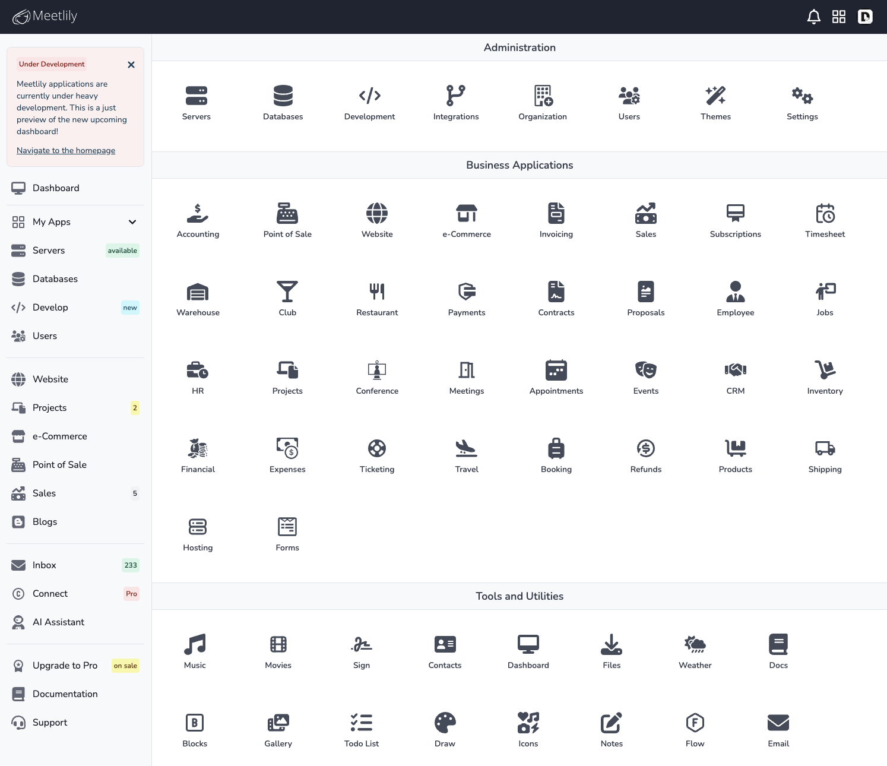
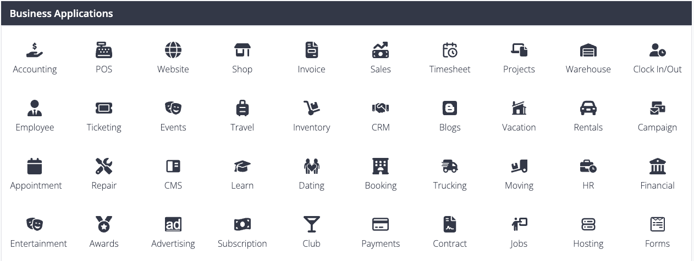
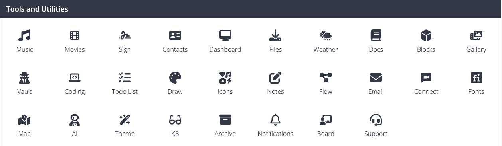

## Meetlily Apps (ERP)



Meetlily Apps (ERP) is a comprehensive suite of business applications built on top of React, Next.js, Prisma, and PostgreSQL. It is designed to streamline and optimize various aspects of your business operations, providing you with powerful tools to manage different departments and processes.

**Key Technologies:**


- React: Meetlily Apps (ERP) leverages the power of React, a popular JavaScript library for building user interfaces. React allows for efficient rendering and seamless updates, providing a smooth and responsive user experience.

- Next.js: The applications are built using Next.js, a framework for server-rendered React applications. Next.js offers benefits such as server-side rendering, automatic code splitting, and simplified routing, enabling faster page loads and improved SEO.

- Prisma: Meetlily Apps (ERP) integrates Prisma, a modern database toolkit, to handle database operations efficiently. Prisma simplifies database management by providing a type-safe and auto-generated query builder, making it easier to work with the PostgreSQL database.

- PostgreSQL: The applications utilize PostgreSQL, a powerful open-source relational database management system. PostgreSQL offers robust data storage, reliability, and scalability, making it an ideal choice for managing business-critical data.

- Supabase: Meetlily Apps (ERP) is integrated with Supabase, an open-source alternative to Firebase. Supabase provides a suite of backend services, including authentication, database management, and real-time updates. This integration enhances the applications with secure user authentication and real-time data synchronization capabilities.

- NextAuth.js: Meetlily Apps (ERP) also integrates NextAuth.js, a flexible authentication library for Next.js applications. NextAuth.js simplifies the implementation of various authentication providers, including social authentication. With NextAuth.js, users can authenticate using popular social platforms such as Google, Facebook, Twitter, and more.

**Development and Hosting:**

Meetlily Apps (ERP) is currently undergoing heavy development, with a focus on continuously improving and expanding its features. The applications are hosted on Vercel, a cloud platform for static and serverless deployments. Vercel offers scalability, reliability, and seamless deployment workflows, ensuring that your applications are always available to your users.

## Features

With Meetlily Apps (ERP), you can streamline your business operations, improve efficiency, and gain valuable insights into your company's performance. Whether it's managing inventory, tracking sales, or analyzing financial data, Meetlily Apps (ERP) provides a comprehensive suite of applications to meet your business needs.

### Administration


- Servers: Easily manage your servers and ensure their smooth operation. Monitor server performance, track resource usage, and handle server configurations effortlessly.

- Databases: Seamlessly integrate with databases to efficiently manage and organize your data. Create and modify database schemas, execute queries, and optimize performance.

#### Development

- Custom Apps: Extend the functionality of Meetlily Apps (ERP) by building custom applications that cater to your unique business processes. Leverage the suite's development capabilities to create tailored solutions.

#### Integrations

- Third-Party Services: Seamlessly integrate with various third-party services and applications. Connect and synchronize data with CRM systems, payment gateways, marketing platforms, and more.

#### Company

- Company Information: Manage your company details, including profile, contact information, and legal documents. Customize the suite to align with your company's branding and requirements.

- User Management: Comprehensive user management capabilities. Create and manage user accounts, assign roles and permissions, and control access to features and modules.

- Settings: Customize Meetlily Apps (ERP) to suit your business needs. Configure preferences, adjust system behavior, and tailor the suite to your specific requirements.

With Meetlily Apps (ERP), you can optimize your business operations, streamline processes, and gain valuable insights into your company's performance. Whether you need to manage servers and databases, develop custom apps, integrate with third-party services, or manage company information and user accounts, Meetlily Apps (ERP) offers a comprehensive suite of applications to support your business growth.

List of Administration Apps

- Servers
- Databases
- Development
- Integrations
- Company
- User Management
- Settings
- Custom Apps

### Business Applications

Meetlily Apps (ERP) is a comprehensive suite of business applications designed to streamline your business operations, improve efficiency, and provide valuable insights into your company's performance. With a wide range of features and functionalities, Meetlily Apps (ERP) offers a complete solution to meet your business needs.



#### Accounting

Efficiently manage your company's financial records, track expenses, generate invoices, and handle payroll with the accounting module of Meetlily Apps (ERP). Gain insights into your financial health and make informed decisions to drive your business forward.

#### Point of Sale (PoS)

Simplify your retail operations with the Point of Sale module of Meetlily Apps (ERP). Process sales transactions, manage inventory, and track customer orders seamlessly. Improve customer experience and streamline your sales processes.

#### Website

Create and manage your company's website with the Website module of Meetlily Apps (ERP). Design and customize your website, publish content, and engage with your online audience. Enhance your online presence and drive business growth.

#### Shop (e-Commerce)

Set up and manage your online store with the e-Commerce module of Meetlily Apps (ERP). Easily add products, handle orders, process payments, and track inventory. Expand your reach and boost your sales in the digital marketplace.

#### Invoicing

Effortlessly generate professional invoices, track payments, and manage billing processes with the Invoicing module of Meetlily Apps (ERP). Streamline your invoicing workflows and ensure timely payments from your customers.

#### Sales

Optimize your sales processes with the Sales module of Meetlily Apps (ERP). Track leads, manage opportunities, and streamline your sales pipeline. Gain insights into your sales performance and drive revenue growth.

#### Timesheet

Efficiently track and manage employee working hours, project time allocation, and attendance with the Timesheet module of Meetlily Apps (ERP). Monitor productivity, streamline payroll processes, and ensure accurate time tracking.

#### Projects

Effectively manage your projects from start to finish with the Projects module of Meetlily Apps (ERP). Plan tasks, allocate resources, track progress, and collaborate with your team. Deliver projects on time and within budget.

#### Warehouse

Streamline your inventory management processes with the Warehouse module of Meetlily Apps (ERP). Track stock levels, manage purchase orders, and optimize warehouse operations. Ensure efficient supply chain management.

#### Clock In/Out

Track employee attendance, manage work shifts, and streamline time tracking with the Clock In/Out module of Meetlily Apps (ERP). Monitor employee productivity and ensure accurate payroll calculations.

#### Employee

Efficiently manage employee information, track performance, and handle HR processes with the Employee module of Meetlily Apps (ERP). Streamline HR operations and foster a productive work environment.

#### Ticketing

Effectively manage customer support and issue resolution with the Ticketing module of Meetlily Apps (ERP). Track customer inquiries, assign tickets to the appropriate team members, and provide timely resolutions.

#### Events

Plan, organize, and manage events seamlessly with the Events module of Meetlily Apps (ERP). Create event schedules, manage registrations, and track attendee information. Ensure successful event execution.

#### Travel

Simplify travel management processes with the Travel module of Meetlily Apps (ERP). Manage travel bookings, track expenses, and streamline reimbursement processes. Ensure smooth business travel operations.

#### Inventory

Efficiently manage your inventory, track stock levels, and optimize supply chain processes with the Inventory module of Meetlily Apps (ERP). Ensure accurate inventory control and minimize stockouts.

#### Customer Relation Management (CRM)

Build and maintain strong customer relationships with the CRM module of Meetlily Apps (ERP). Track customer interactions, manage leads, and streamline sales processes. Enhance customer satisfaction and loyalty.

#### Blogs

Create and manage engaging blog content with the Blog module of Meetlily Apps (ERP). Publish articles, manage categories, and engage with your audience. Drive traffic to your website and establish thought leadership.

#### Vacation

Streamline employee vacation management processes with the Vacation module of Meetlily Apps (ERP). Track vacation requests, manage approvals, and ensure accurate leave balance calculations. Simplify vacation planning for your workforce.

#### Rentals

Efficiently manage rental properties, track bookings, and handle rental agreements with the Rentals module of Meetlily Apps (ERP). Simplify rental operations and ensure smooth tenant management.

#### Marketing Campaign

Plan, execute, and track marketing campaigns with the Marketing Campaign module of Meetlily Apps (ERP). Manage campaign assets, track performance metrics, and optimize marketing efforts. Drive customer engagement and generate leads.

#### Appointment

Effortlessly manage appointments and bookings with the Appointment module of Meetlily Apps (ERP). Schedule appointments, send reminders, and handle calendar management. Streamline appointment booking processes.

#### Repair

Effectively manage repair services and track service requests with the Repair module of Meetlily Apps (ERP). Streamline repair workflows, track repair status, and ensure timely service delivery.

#### Content Management System (CMS)

Create, manage, and publish content on your website with the Content Management System module of Meetlily Apps (ERP). Customize website layouts, manage media assets, and streamline content publishing processes.

#### Learning Management System (LMS)

Deliver online training and educational courses with the Learning Management System module of Meetlily Apps (ERP). Create and manage courses, track learner progress, and facilitate online learning experiences.

#### Dating

Create and manage a dating platform with the Dating module of Meetlily Apps (ERP). Enable user profiles, match algorithms, and messaging features. Facilitate connections and enhance the dating experience.

#### Booking

Streamline booking processes for services, appointments, or resources with the Booking module of Meetlily Apps (ERP). Enable online reservations, manage availability, and handle booking confirmations.

#### Trucking and Delivery Services

Efficiently manage trucking and delivery services with the Trucking and Delivery Services module of Meetlily Apps (ERP). Track shipments, manage routes, and optimize logistics operations. Ensure timely and efficient deliveries.

#### Moving

Simplify moving and relocation processes with the Moving module of Meetlily Apps (ERP). Manage move requests, track inventory, and handle logistics. Streamline the moving experience for your customers.

#### Human Resources (HR)

Streamline HR processes, manage employee information, and handle HR-related tasks with the Human Resources module of Meetlily Apps (ERP). Simplify HR operations and ensure compliance with HR policies.

#### Financial Management

Efficiently manage your company's finances with the Financial Management module of Meetlily Apps (ERP). Track income and expenses, generate financial reports, and ensure accurate financial planning.

#### Entertainment

Create and manage entertainment events, bookings, and ticket sales with the Entertainment module of Meetlily Apps (ERP). Streamline event management processes and enhance the entertainment experience.

#### Awards

Manage employee recognition programs and awards with the Awards module of Meetlily Apps (ERP). Track achievements, assign awards, and foster a culture of appreciation within your organization.

#### Advertising

Plan, execute, and track advertising campaigns with the Advertising module of Meetlily Apps (ERP). Manage ad placements, track performance metrics, and optimize advertising strategies. Drive brand awareness and customer engagement.

#### Subscription

Manage subscription-based services and recurring payments with the Subscription module of Meetlily Apps (ERP). Handle subscription plans, track subscriptions, and automate billing processes. Ensure seamless subscription management.

#### Club/Restaurant

Efficiently manage club or restaurant operations with the Club/Restaurant module of Meetlily Apps (ERP). Handle reservations, track table availability, manage menus, and streamline order processing. Enhance customer dining experiences.

#### Payments

Streamline payment processes and handle online transactions with the Payments module of Meetlily Apps (ERP). Accept various payment methods, track payment status, and ensure secure and efficient payment processing.

#### Contract

Manage contracts and agreements with the Contract module of Meetlily Apps (ERP). Create and store contract templates, track contract status, and handle contract renewals. Simplify contract management processes.

#### Jobs

Efficiently manage job postings, candidate applications, and recruitment processes with the Jobs module of Meetlily Apps (ERP). Streamline hiring workflows and ensure efficient talent acquisition.

#### Hosting

Manage your hosting services, including virtual, dedicated, cloud servers, web, email, and database hosting, with the Hosting module of Meetlily Apps (ERP). Track server resources, handle configurations, and ensure reliable hosting services.

#### Forms

Create and manage custom forms and surveys with the Forms module of Meetlily Apps (ERP). Collect data, analyze responses, and gain insights into customer preferences. Streamline data collection processes.

With Meetlily Apps (ERP), you can leverage a wide range of business applications to streamline your operations, enhance productivity, and drive business growth. From accounting and sales to marketing campaigns and employee management, Meetlily Apps (ERP) offers a comprehensive suite of applications to meet your unique business needs.

### Tools and Utilities

Access a variety of tools and utilities within Meetlily Apps (ERP) to enhance your productivity and streamline your workflows. From file management and documentation management to coding and weather updates, these tools and utilities provide valuable functionality for your daily tasks.



#### Music

Enjoy a built-in music player that allows you to listen to your favorite tunes while working. Create playlists, shuffle songs, and adjust volume settings without leaving Meetlily Apps (ERP). Stay focused and motivated with your personalized music selection.

#### Movies

Access a curated collection of movies within Meetlily Apps (ERP). Browse through different genres, watch trailers, and stream movies directly from the platform. Enjoy your favorite films during your downtime or as a source of inspiration.

#### Sign

Easily create and manage digital signatures with the Sign tool in Meetlily Apps (ERP). Sign documents electronically, securely store your signatures, and streamline the signing process. Ensure efficient and legally binding document workflows.

#### Contacts

Manage your contacts efficiently with the Contacts feature in Meetlily Apps (ERP). Store contact details, categorize contacts, and easily search for specific individuals or organizations. Keep your contact information organized and accessible.

#### Dashboard

Access a customizable dashboard within Meetlily Apps (ERP) to get an overview of your key metrics and important information. Configure widgets, charts, and graphs to display data relevant to your business. Stay informed and make data-driven decisions.

#### File Management

Effortlessly manage your files and documents with the File Management tool in Meetlily Apps (ERP). Upload, organize, and share files securely. Collaborate with team members and ensure easy access to important documents.

#### Weather

Stay updated on the weather conditions with the Weather feature in Meetlily Apps (ERP). Get real-time weather forecasts, temperature information, and weather alerts. Plan your activities accordingly and stay prepared.

#### Documentation Management

Efficiently manage your documentation with the Documentation Management tool in Meetlily Apps (ERP). Create, organize, and share documents within your organization. Collaborate on documentation projects and ensure version control.

#### Blocks, Components, and Templates

Access a library of pre-designed blocks, components, and templates within Meetlily Apps (ERP). Easily create professional-looking websites, landing pages, and email templates. Customize and reuse these elements to save time and maintain consistency.

#### Gallery

Organize and showcase your images and media files with the Gallery feature in Meetlily Apps (ERP). Create albums, add descriptions, and share your visual content with others. Present your work or memories in a visually appealing manner.

#### Vault

Securely store and manage sensitive information with the Vault tool in Meetlily Apps (ERP). Safeguard passwords, credit card details, and other confidential data. Access your information whenever you need it, with encryption and advanced security measures.

#### Coding

Access a built-in code editor within Meetlily Apps (ERP) to write, edit, and test your code. Enjoy syntax highlighting, code completion, and other helpful features. Streamline your coding tasks and collaborate with team members.

#### Todo List

Stay organized and manage your tasks effectively with the Todo List feature in Meetlily Apps (ERP). Create to-do lists, set deadlines, and track your progress. Prioritize your tasks and ensure nothing falls through the cracks.

#### Draw

Unleash your creativity with the Draw tool in Meetlily Apps (ERP). Sketch, doodle, and create digital artwork directly within the platform. Express your ideas visually and collaborate with others on design projects.

#### Icons

Access a wide range of icons within Meetlily Apps (ERP) to enhance your user interfaces and visual elements. Choose from a diverse collection of icons and easily integrate them into your projects. Customize the appearance and style of the icons to match your branding.

#### Notes/Markdown Editor

Take notes and write in Markdown format with the Notes/Markdown Editor in Meetlily Apps (ERP). Create rich-text documents, format text, and add images. Organize your notes and access them whenever you need to reference or share information.

#### Flow and Diagrams (Data Visualization)

Visualize your data and processes with the Flow and Diagrams tool in Meetlily Apps (ERP). Create flowcharts, diagrams, and visual representations of your workflows. Gain insights and communicate complex ideas effectively.

#### Email

Manage your email communication within Meetlily Apps (ERP). Access your email accounts, send and receive messages, and organize your inbox. Stay connected and handle your email correspondence seamlessly.

#### Connect Chat and Video Conference

Collaborate with team members and clients through chat and video conferences within Meetlily Apps (ERP). Initiate real-time conversations, share screens, and hold virtual meetings. Foster effective communication and enhance collaboration.

#### Fonts Management

Manage your fonts and typography within Meetlily Apps (ERP). Upload and organize your font files, preview different fonts, and apply them to your projects. Ensure consistent and visually appealing typography across your designs.

#### Maps

Integrate maps and location-based services into your applications with the Maps feature in Meetlily Apps (ERP). Display interactive maps, geocode addresses, and provide directions. Enhance user experiences with location-based functionalities.

#### AI (AI content generation, Machine Learning, Bot Assistant)

Leverage the power of artificial intelligence within Meetlily Apps (ERP). Generate content using AI algorithms, implement machine learning models, and utilize a bot assistant for automated tasks. Enhance efficiency and explore innovative solutions.

#### Theme and Template Configurations

Customize the themes and templates within Meetlily Apps (ERP) to match your branding and design preferences. Adjust colors, typography, and layout configurations. Create a cohesive and visually appealing user experience.

#### Knowledge Base (KB)

Create and manage a knowledge base within Meetlily Apps (ERP). Organize articles, FAQs, and documentation for easy access and self-service support. Empower your users with valuable information and reduce support requests.

#### Archive

Archive and store old or inactive data within Meetlily Apps (ERP). Keep your active database clutter-free while retaining access to historical information

## Installation

First, run the development server:

```bash
npm run dev
# or
yarn dev
# or
pnpm dev
```

Open [http://localhost:3000](http://localhost:3000) with your browser to see the result.

You can start editing the page by modifying `app/page.tsx`. The page auto-updates as you edit the file.

This project uses [`next/font`](https://nextjs.org/docs/basic-features/font-optimization) to automatically optimize and load Inter, a custom Google Font.

## Learn More

To learn more about Next.js, take a look at the following resources:

- [Next.js Documentation](https://nextjs.org/docs) - learn about Next.js features and API.
- [Learn Next.js](https://nextjs.org/learn) - an interactive Next.js tutorial.

You can check out [the Next.js GitHub repository](https://github.com/vercel/next.js/) - your feedback and contributions are welcome!

## Deploy on Vercel

The easiest way to deploy your Next.js app is to use the [Vercel Platform](https://vercel.com/new?utm_medium=default-template&filter=next.js&utm_source=create-next-app&utm_campaign=create-next-app-readme) from the creators of Next.js.

Check out our [Next.js deployment documentation](https://nextjs.org/docs/deployment) for more details.
